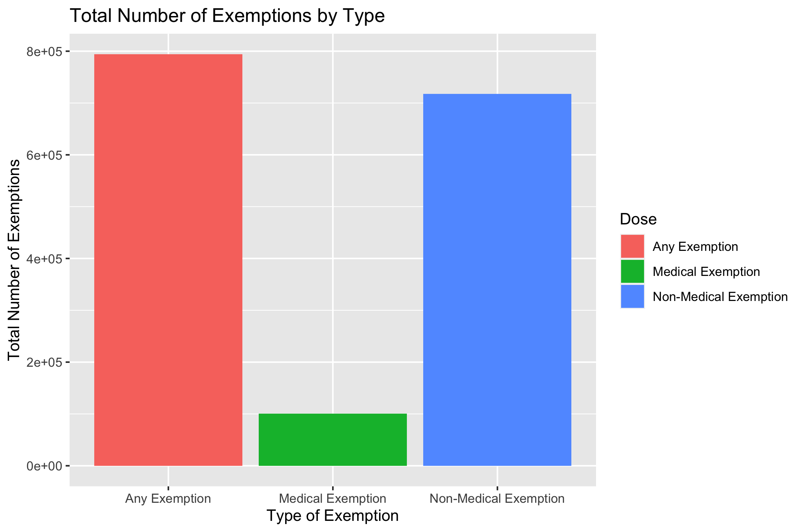
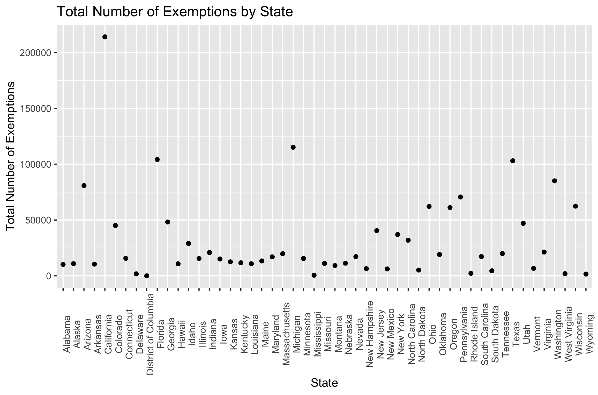
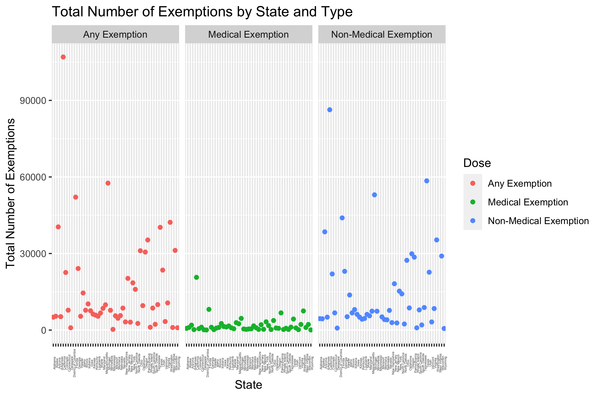
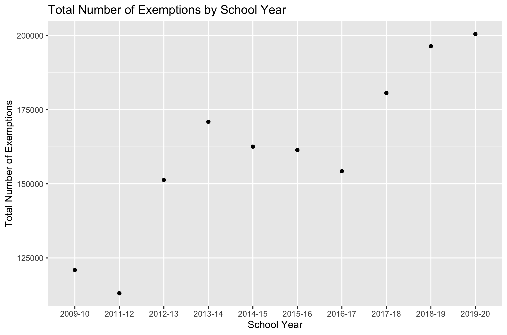

This document details the results from exploring the Vaccine Exemption dataset
downloaded from the CDC website in order to answer a couple of questions.


## Questions/Hypotheses to be addressed

What is the most common type of exemption?
What state(s) have the highest rate of exemptions? 
How do different rates of different types of exemptions vary among states
How have exemption rates changed over time? 

## Data import and cleaning

```{r, include=FALSE}
#load needed packages. make sure they are installed.
library(readxl) #for loading Excel files
library(dplyr) #for data processing
library(here) #to set paths

#path to data
#note the use of the here() package and not absolute paths

# For this exercise, we'll look at a dataset from the CDC data website:
# (https://data.cdc.gov/Vaccinations/Vaccination-Coverage-and-Exemptions-among-Kinderga/ijqb-a7ye)
# which contains data on vaccine coverage and exemptions for kindergartners at 
# the state and national level. 

data_location <- here::here("data", "raw_data", "Vaccination_Coverage_and_Exemptions_among_Kindergartners.csv")
#load data. 

rawdata <- read.csv(data_location)

#take a look at the data
dplyr::glimpse(rawdata)

# it looks like the variable vaccine.exemption is pretty broad - it either contains
# an observation of a vaccine and it's coverage or an observation of an exemption 
# (not an exemption of a particular vaccine type, but a general observation of an 
# exemption and it's type - medical, non-medical, etc.)
# there are some problems with this data:
# there are missing values in the exemption column for observations which are 
# vaccine types and not exemptions. We could fix that by only looking at exemptions

# Let's just look at exemptions and remove other observation types
# We'll also remove Percent Surveyed, Survey Type, and Footnotes, since these
# variables are missing 
# values or do not contain necessary info for this analysis
# Also, the state data does not align well with the national data. Let's just look at state data
# We'll be left with observations of the following variables: exemptions, dose 
# (exemption type), estimate (%), 
# school year, state, population size, and number of exemptions


processeddata <- filter(rawdata, Vaccine.Exemption == "Exemption") %>%
  select(-"Percent.Surveyed", -"Footnotes", -"Survey.Type") %>%
  filter(Geography.Type == "States")

# look at missing data
is.na(processeddata)

# There appear to be some observations with NA values - I don't think we can infer whether
# NA values represent 0 exemptions, or whether the data is truly missing. So, let's remove those for a 
# cleaner dataset

processeddata <- processeddata %>% na.omit(Number.of.Exemptions)

# This gives us a cleaner set of observation to work with. Looking at these exemptions, our outcome
# of interest will be the most common exemption types as well as which states 
# have the highest exemption rates within different types

# Some of my initial thoughts on what questions to look at with this clean data include:
# - what is the most common type of exemption?
# - what state(s) have the highest rate of exemptions? 
# - how do different rates of different types of exemptions vary among states
# - how have exemption rates changed over time? 


# save data as RDS
# location to save file
save_data_location <- here::here("data","processed_data","processeddata.rds")

saveRDS(processeddata, file = save_data_location)


```


## Exploratory analysis


Table \@ref(tab:summarytable) shows a table summarizing the data.


```{r summarytable,  echo=FALSE}
resulttable=readRDS("../../results/summarytable.rds")
knitr::kable(resulttable, caption = 'Data summary table.')
```


Figure \@ref(fig:Plot1) shows a bar graph detailing that Any Exemption is the most common type of exemption.

```{r Plot2,  fig.cap='Plot 1.', echo=FALSE}

```


Figure \@ref(fig:Plot2) shows a scatterplot detailing that California has the highest number of total exemptions.

```{r Plot2,  fig.cap='Plot 2.', echo=FALSE}

```

Figure \@ref(fig:Plot3) details the total number of exemptions by state and type. The general trend is that states have higher numbers of non-medical exemptions than medical exemptions.

```{r Plot3,  fig.cap='Plot 3.', echo=FALSE}

```


Figure \@ref(fig:Plot4) details that the total number of exemptions rose dramatically from 2011-12 to 2013-14, stabilized for a while until 2016-17, and then continued to rise from there into the current day.

```{r Plot4,  fig.cap='Plot 4.', echo=FALSE}

```


